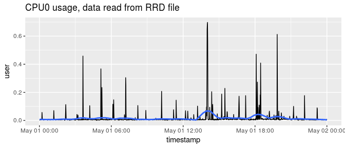

<!-- README.md is generated from README.Rmd. Please edit that file -->
rrd
===

The `rrd` package allows you to read data from an [RRD](http://oss.oetiker.ch/rrdtool/) database.

Internally it uses [librrd](http://oss.oetiker.ch/rrdtool/doc/librrd.en.html) to import the binary data directly into R without exporting it to an intermediate format first.

For an introduction to RRD database, see <https://oss.oetiker.ch/rrdtool/tut/rrd-beginners.en.html>

Installation
------------

### Pre-requisites

In order to build the package from source you need [librrd](http://oss.oetiker.ch/rrdtool/doc/librrd.en.html). Installing [RRDtool](http://oss.oetiker.ch/rrdtool/) from your package manager will usually also install the library.

In ubuntu:

``` sh
sudo apt-get install rrdtool librrd-dev
```

In RHEL / CentOS:

``` sh
sudo yum install rrdtool rrdtool-devel
```

### Installing from CRAN

`rrd` is not yet on CRAN

### Installing from github

And the development version from [GitHub](https://github.com/) with:

``` r
# install.packages("devtools")
devtools::install_github("pldimitrov/rrd")
```

Example
-------

In R:

``` r
library(rrd)
```

To describe the contents of an RRD file, use `describe_rrd()`:

``` r
rrd_cpu_0 <- system.file("extdata/cpu-0.rrd", package = "rrd")

describe_rrd(rrd_cpu_0)
#> A RRD file with 10 RRA arrays and step size 60
#> [1] AVERAGE_60 (43200 rows)
#> [2] AVERAGE_300 (25920 rows)
#> [3] MIN_300 (25920 rows)
#> [4] MAX_300 (25920 rows)
#> [5] AVERAGE_3600 (8760 rows)
#> [6] MIN_3600 (8760 rows)
#> [7] MAX_3600 (8760 rows)
#> [8] AVERAGE_86400 (1825 rows)
#> [9] MIN_86400 (1825 rows)
#> [10] MAX_86400 (1825 rows)
```

To read an entire RRD file, i.e. all of the RRA archives, use `read_rrd()`. This returns a list of `tibble` objects:

``` r
cpu <- read_rrd(rrd_cpu_0)

str(cpu, max.level = 1)
#> List of 10
#>  $ AVERAGE60   :Classes 'tbl_df', 'tbl' and 'data.frame':    43199 obs. of  9 variables:
#>  $ AVERAGE300  :Classes 'tbl_df', 'tbl' and 'data.frame':    25919 obs. of  9 variables:
#>  $ MIN300      :Classes 'tbl_df', 'tbl' and 'data.frame':    25919 obs. of  9 variables:
#>  $ MAX300      :Classes 'tbl_df', 'tbl' and 'data.frame':    25919 obs. of  9 variables:
#>  $ AVERAGE3600 :Classes 'tbl_df', 'tbl' and 'data.frame':    8759 obs. of  9 variables:
#>  $ MIN3600     :Classes 'tbl_df', 'tbl' and 'data.frame':    8759 obs. of  9 variables:
#>  $ MAX3600     :Classes 'tbl_df', 'tbl' and 'data.frame':    8759 obs. of  9 variables:
#>  $ AVERAGE86400:Classes 'tbl_df', 'tbl' and 'data.frame':    1824 obs. of  9 variables:
#>  $ MIN86400    :Classes 'tbl_df', 'tbl' and 'data.frame':    1824 obs. of  9 variables:
#>  $ MAX86400    :Classes 'tbl_df', 'tbl' and 'data.frame':    1824 obs. of  9 variables:
```

Since the resulting object is a list of `tibble`s, you can easily work with individual data frames:

``` r
names(cpu)
#>  [1] "AVERAGE60"    "AVERAGE300"   "MIN300"       "MAX300"      
#>  [5] "AVERAGE3600"  "MIN3600"      "MAX3600"      "AVERAGE86400"
#>  [9] "MIN86400"     "MAX86400"

cpu[[1]]
#> # A tibble: 43,199 x 9
#>    timestamp              user     sys  nice  idle  wait   irq softirq
#>  * <dttm>                <dbl>   <dbl> <dbl> <dbl> <dbl> <dbl>   <dbl>
#>  1 2018-04-02 12:24:00 0.0104  0.00811     0 0.981     0     0       0
#>  2 2018-04-02 12:25:00 0.0126  0.00630     0 0.979     0     0       0
#>  3 2018-04-02 12:26:00 0.0159  0.00808     0 0.976     0     0       0
#>  4 2018-04-02 12:27:00 0.00853 0.00647     0 0.985     0     0       0
#>  5 2018-04-02 12:28:00 0.0122  0.00999     0 0.978     0     0       0
#>  6 2018-04-02 12:29:00 0.0106  0.00604     0 0.983     0     0       0
#>  7 2018-04-02 12:30:00 0.0147  0.00427     0 0.981     0     0       0
#>  8 2018-04-02 12:31:00 0.0193  0.00767     0 0.971     0     0       0
#>  9 2018-04-02 12:32:00 0.0300  0.0274      0 0.943     0     0       0
#> 10 2018-04-02 12:33:00 0.0162  0.00617     0 0.978     0     0       0
#> # ... with 43,189 more rows, and 1 more variable: stolen <dbl>

tail(cpu$AVERAGE60$sys)
#> [1] 0.0014390667 0.0020080000 0.0005689333 0.0000000000 0.0014390667
#> [6] 0.0005689333
```

To read a single RRA archive from an RRD file, use `read_rra()`. To use this function, you must specify several arguments that define the specific data to retrieve. This includes the consolidation function (e.g. "AVERAGE") and time step (e.g. 60), the `end` time. You must also specifiy either the `start` time, or the number of steps, `n_steps`.

In this example, you extract the average for 1 minute periods (`step = 60`), for one entire day (`n_steps = 24 * 60`):

``` r
end_time <- as.POSIXct("2018-05-02") # timestamp with data in example
avg_60 <- read_rra(rrd_cpu_0, cf = "AVERAGE", step = 60, n_steps = 24 * 60,
                     end = end_time)

avg_60
#> # A tibble: 1,440 x 9
#>    timestamp              user      sys  nice  idle     wait   irq softirq
#>  * <dttm>                <dbl>    <dbl> <dbl> <dbl>    <dbl> <dbl>   <dbl>
#>  1 2018-05-01 00:01:00 0.00458 0.00201      0 0.992 0            0       0
#>  2 2018-05-01 00:02:00 0.00258 0.000570     0 0.996 0            0       0
#>  3 2018-05-01 00:03:00 0.00633 0.00144      0 0.992 0            0       0
#>  4 2018-05-01 00:04:00 0.00515 0.00201      0 0.991 0            0       0
#>  5 2018-05-01 00:05:00 0.00402 0.000569     0 0.995 0            0       0
#>  6 2018-05-01 00:06:00 0.00689 0.00144      0 0.992 0            0       0
#>  7 2018-05-01 00:07:00 0.00371 0.00201      0 0.993 0.00144      0       0
#>  8 2018-05-01 00:08:00 0.00488 0.00201      0 0.993 0.000569     0       0
#>  9 2018-05-01 00:09:00 0.00748 0.000568     0 0.992 0            0       0
#> 10 2018-05-01 00:10:00 0.00516 0            0 0.995 0            0       0
#> # ... with 1,430 more rows, and 1 more variable: stolen <dbl>
```

And you can easily plot using your favourite packages:

``` r
library(ggplot2)
ggplot(avg_60, aes(x = timestamp, y = user)) + 
  geom_line() +
  stat_smooth(method = "loess", span = 0.125, se = FALSE) +
  ggtitle("CPU0 usage, data read from RRD file")
```



More information
----------------

For more information on `rrdtool` and the `rrd` format please refer to the official [rrdtool documentation](http://oss.oetiker.ch/rrdtool/doc/index.en.html) and [tutorials](http://oss.oetiker.ch/rrdtool/tut/index.en.html).

You can read a more in-depth description of the package and more examples in this [blog post](http://plamendimitrov.net/blog/2014/08/09/r-package-for-working-with-rrd-files/).
